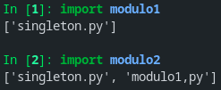

# Padrões de Criação

## Singleton

Tem como objetivo ter um único objeto de um determinado tipo para acesso/uso global. Um padrão utilizado em casos de loggin, operações de banco de dados, spoolers de impressão e demais cenários em seja necessário que haja apenas uma instância disponível para toda a aplicação a fim de evitar conflitos nas requisições.

Resumidamente as intenções deste padrão são:

- garantir que somente um objeto da classe seja criado;
- disponibilizar um ponto de acesso global ao objeto, onde todo o programa possa usar;
- controle de acesso concorrente a recursos compartilhados;

Existem algumas formas de implementar o padrão, algumas delas são:

- em nível de módulo

    ```python
    # singleton.py
    acesso_global = ["singleton.py"]
    ```

    ```python
    # modulo1.py
    import singleton


    print(singleton.acesso_global)
    singleton.acesso_global.append("modulo1,py")
    ```

    ```python
    # modulo2.py
    import singleton


    print(singleton.acesso_global)
    ```

    execução

    

    como é possível observar, ao executar o `modulo1.py` é inserido um valor na variável de `singleton.py`, onde é possível verificar essa inserssão ao executar o `modulo2.py`

- clássico

    A ideia aqui é criar o objeto caso ainda não tenha sido criado, caso contrário, é retornado o objeto criado anteriormente.

    ```python
    class Singleton:
        def __new__(cls):
            if not hasattr(cls, 'instance'):
                cls.instance = super(Singleton, cls).__new__(cls)
            return cls.instance

    class SingletonFilho(Singleton):
        pass

    primeiro_singleton = Singleton()
    segundo_singleton = Singleton()

    if primeiro_singleton is segundo_singleton:
        print("ambos referem-se ao mesmo endereço de memória")
        print(f"primeiro_singleton: {id(primeiro_singleton)}")
        print(f"segundo_singleton:  {id(segundo_singleton)}")

    singleton_filho = SingletonFilho()
    primeiro_singleton.variavel_global = [1,]

    print(f"segundo_singleton.variavel_global: {segundo_singleton.variavel_global}")
    print(f"singleton_filho.variavel_global: {singleton_filho.variavel_global}")
    ```


- Borg
